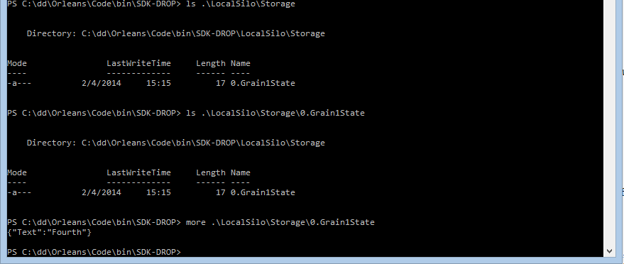

# Custom Storage Providers

## Writing a Custom Storage Provider

In the tutorial on declarative actor storage, we looked at allowing grains to store their state in an Azure table using one of the built-in storage providers.
While Azure is a great place to squirrel away your data, there are many alternatives.
In fact, there are so many that there was no way to support them all.
Instead, Orleans is designed to let you easily add support for your own form of storage by writing a storage provider.

In this tutorial, we'll walk through how to write a simple file-based storage provider.
A file system is not necessarily the best place to store data for grains, since it's so local, but it's an easy example to help us illustrate the principles.

## Getting Started
An Orleans storage provider is simply a class that implements `IStorageProvider`.
It should be built into an assembly that is placed in the Orleans binaries folder.
To move it there on build will require adding a bit of post-build event code.

We'll start by creating the project -- it should be a regular .NET class library.
Once the project is created, let's also rename the file _Class1.cs_ to _FileStorageProvider.cs_.
That should also prompt VS to rename the class we find inside.
Next, we must add references to [Microsoft.Orleans.Core NuGet package](https://www.nuget.org/packages/Microsoft.Orleans.Core/).

Assuming, of course, that your project is called `StorageProviders`, make your silo host project reference it, so that StorageProviders.dll gets copied to the silo folder.

Our storage provider should implement the interface `Orleans.Storage.IStorageProvider`.
With a little bit of massaging of the code, it should look something like this:

``` csharp
using System;
using System.Threading.Tasks;
using System.Collections.Generic;

using Orleans;
using Orleans.Storage;
using Orleans.Runtime;
using Newtonsoft.Json;
using Orleans.Serialization;

namespace StorageProviders
{
    public class FileStorageProvider : IStorageProvider
    {
        private JsonSerializerSettings _jsonSettings;

        public Logger Log { get; set; }

        public string Name { get; set; }

        public Task Init(string name, Orleans.Providers.IProviderRuntime providerRuntime,
                      Orleans.Providers.IProviderConfiguration config)
        {
            throw new NotImplementedException();
        }

        public Task Close()
        {
            throw new NotImplementedException();
        }

        public Task ReadStateAsync(string grainType,
                                   GrainReference grainRef,
                                   IGrainState grainState)
        {
            throw new NotImplementedException();
        }

        public Task WriteStateAsync(string grainType,
                                    GrainReference grainRef,
                                    IGrainState grainState)
        {
             throw new NotImplementedException();
        }

        public Task ClearStateAsync(string grainType,
                                    GrainReference grainRef,
                                    IGrainState grainState)
        {
            throw new NotImplementedException();
        }
    }
}
```

The first thing we have to figure out is what data we need to provide through configuration. 
The name is a required property, but we will also need the path to the root directory for our file store.
That is, in fact, the only piece of information we need, so we'll add a `RootDirectory` string property and edit the configuration file as in the previous section.
In doing so, it's critical to pay attention to the namespace and class name of the provider.
Add this to the `<StorageProviders>` element in the `OrleansConfiguration.xml` configuration file of your silo host project where you will be testing the provider:


     <Provider Type="StorageProviders.FileStorageProvider"
              Name="FileStore"
              RootDirectory=".\Storage"/>


Edit the _Grain1.cs_ file to use this storage provider instead of the Azure provider, then set a breakpoint in the `Init()` method of the storage provider implementation class and start the silo.
If you have followed the instructions, you should hit the breakpoint during silo initialization.
There's no reason to go on debugging, since you will throw an exception right away.

## Initializing the Provider
There are four major functions to implement in the provider -- `Close()` is the only one we won't need to do anything with.
As you may have guessed, the starting point is the call to `Init()`, which provides us with the configuration data and a chance to get things set up properly.
In our case, we'll want to set the properties and create the root directory if it doesn't already exist:

``` csharp
public Task Init(string name,
                 Orleans.Providers.IProviderRuntime providerRuntime,
                 Orleans.Providers.IProviderConfiguration config)
{
     _jsonSettings = SerializationManager.UpdateSerializerSettings(SerializationManager.GetDefaultJsonSerializerSettings(), config);

    this.Name = name;
    if (string.IsNullOrWhiteSpace(config.Properties["RootDirectory"]))
        throw new ArgumentException("RootDirectory property not set");

    var directory = new System.IO.DirectoryInfo(config.Properties["RootDirectory"]);
    if (!directory.Exists)
        directory.Create();

    this.RootDirectory = directory.FullName;

    return TaskDone.Done;
}
```

Run the program again.
This time, you will still crash, but in `ReadStateAsync()`.
After running the code, you should find a _Storage_ directory under the `bin\Debug` directory of the silo host project.
Make sure you have set the project up to build on F5, or you may not see the edits take effect.

## Reading State
To store data in the file system (or anywhere, really), we have to devise a convention that generates a unique name for each grain.
This is easiest done by combining the state type name with the grain id, which combines the grain type and GUID creating a globally unique key.
Thus, `ReadStateAsync()` (which, by the way, should be declared as an async method), starts like this:


``` csharp
var collectionName = grainState.GetType().Name;
var key = grainRef.ToKeyString();

var fName = key + "." + collectionName;
var path = System.IO.Path.Combine(RootDirectory, fName);

var fileInfo = new System.IO.FileInfo(path);
if (!fileInfo.Exists)
    return;
```

We also need to decide how the data will be stored.
To make it easy to inspect the data outside of the application, we're going to use JSON.
A more space-conscious design may use a binary serialization format, instead, it's entirely a choice of the provider designer's.

``` csharp
using (var stream = fileInfo.OpenText())
{
    var storedData = await stream.ReadToEndAsync();

    grainState.State = JsonConvert.DeserializeObject(storedData, grainState.State.GetType(), _jsonSettings);
}
```

## Writing State
The format decisions have already been made, so coding up the `WriteStateAsync` method should be straight-forward: serialize as JSON, construct the file name, then write to the file:


``` csharp
public async Task WriteStateAsync(string grainType, GrainReference grainRef, IGrainState grainState)
{
    var storedData = JsonConvert.SerializeObject(grainState.State, _jsonSettings);

    var collectionName = grainState.GetType().Name;
    var key = grainRef.ToKeyString();

    var fName = key + "." + collectionName;
    var path = System.IO.Path.Combine(RootDirectory, fName);

    var fileInfo = new System.IO.FileInfo(path);

    using (var stream = new System.IO.StreamWriter(
               fileInfo.Open(System.IO.FileMode.Create,
                             System.IO.FileAccess.Write)))
    {
        await stream.WriteAsync(storedData);
    }
}
```

## Putting it Together

There's really just one thing left to do, and that is to test the thing.
Run the application and let it get to the end, where the greetings are shown, and then terminate it.
Under the _bin\Debug\Storage_ directory of your silo host project, you should find a file called _0.Grain1State_, and it should contain something very recognizable:



Run the application again, and you should see the same behaviour as before, that is, the last greeting of the first session is remembered.

## Clearing State

The easiest method to write is the one that deletes grain state, which we didn't see any use of in the previous tutorial.
In fact, we don't need it for our Hello World application, so we'll just leave its implementation as an exercise.
It should do the obvious, i.e. delete the file.

## Next

We'll look at how you can unit test grains:

[Unit Testing Grains](Unit-Testing-Grains.md)
