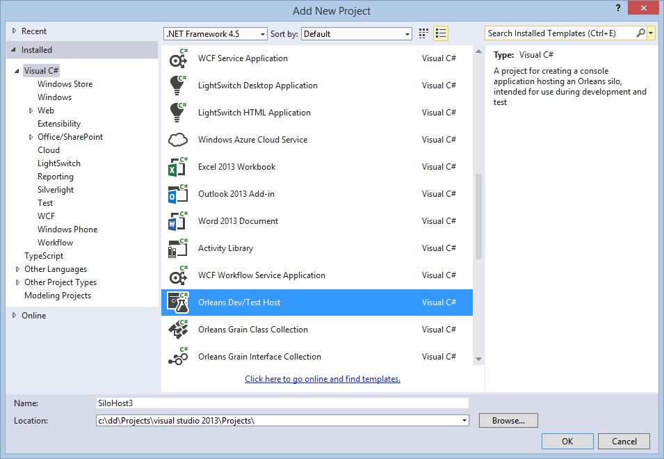
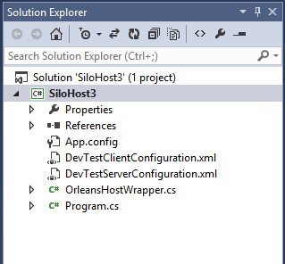
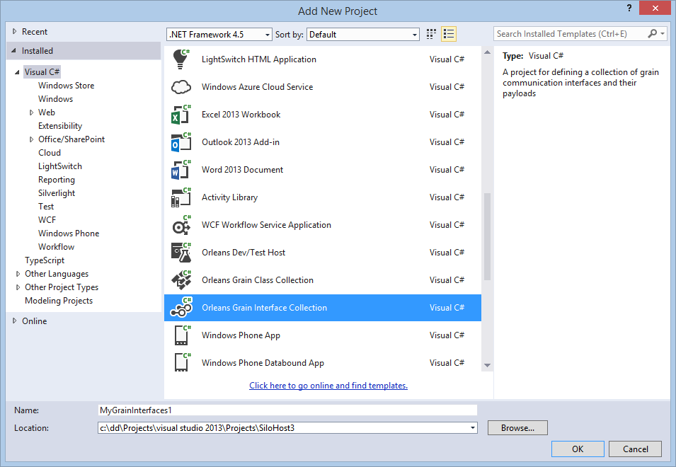
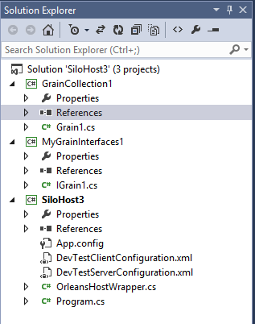
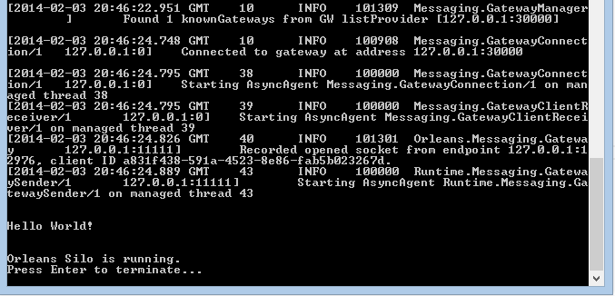

# My First Orleans Application

In this tutorial, we will walk through the steps to get the simplest possible Orleans application up and running, the all-too-familiar "Hello World!".
We're using VS 2017, but it works equally well with VS 2012, VS 2013 and VS 2015.

Before we start, there are three Orleans concepts that you will run into in this tutorial: that of a grain, a communication interface, and a silo.

### Grains
Grains form the core of the Orleans programming model - they are distributed virtual actors.
Grains are .NET classes that derive from a particular base class.
It is easy to think about actors as objects that get dynamically instantiated on different servers and can invoke each other.
They are distributed because interactions with grains may happen across process and computer boundaries, virtual because a particular grain may not be loaded in memory when another component sends it a message.
If not present, the grain will be activated on-demand.

### Communication interfaces
Communication interfaces describe how to communicate with grains.
They are .NET interfaces extending a particular base interface.

### Silos
Silos are containers of grains, potentially millions of grains in a single silo.
Typically, you will run one silo per machine, but it sometimes make sense to run more than one on a single machine, when testing, for example.

## Getting Started

Before getting started, make sure the Microsoft Orleans Tools for Visual Studio is installed. The plugin can be downloaded from:
https://marketplace.visualstudio.com/items?itemName=sbykov.MicrosoftOrleansToolsforVisualStudio

After starting Visual Studio, go to create a new project.
Under "Visual C#," you should see the following:



Choose the "Orleans Dev/Test Host" project type, create a directory for the solution, and create the project:



At this point go ahead and compile your project to download the packages.

The project is just a console application populated with code that helps you host a silo in an environment that is "developer friendly," i.e. where everything runs in a single process.

The main code does three things: it creates a silo, initializes the Orleans client runtime, and waits for user input before terminating:


``` csharp
static void Main(string[] args)
{
    // First, configure and start a local silo
    var siloConfig = ClusterConfiguration.LocalhostPrimarySilo();
    var silo = new SiloHost("TestSilo", siloConfig);
    silo.InitializeOrleansSilo();
    silo.StartOrleansSilo();

    Console.WriteLine("Silo started.");

    // Then configure and connect a client.
    var clientConfig = ClientConfiguration.LocalhostSilo();
    var client = new ClientBuilder().UseConfiguration(clientConfig).Build();
    client.Connect().Wait();

    Console.WriteLine("Client connected.");

    //
    // This is the place for your test code.
    //

    Console.WriteLine("\nPress Enter to terminate...");
    Console.ReadLine();

    // Shut down
    client.Close();
    silo.ShutdownOrleansSilo();
}
```

## Adding Some Grains

At this point, we have everything we need except some actual Orleans-based code.
Next we will create two more projects, one to hold the communication interface, and one to hold our grain.
Separating the two is a best practice since the interface project is shared between the client and server-side, while the grains are implementation code and should be private to the server side.

In addition to the Dev/Test host, there are two more Orleans projects, and we should create one of each in our solution:



Once you have them in your solution, make sure to add a reference to the grain interface project from each of the other projects: the host, which will contain our client code, and the grain collection project.

Add a reference for the grain collection project to the host project, so that it is automatically (re-)built and copied when starting the debugger.



Open the _IGrain1.cs_ file and add a method `SayHello()` to it.
We should have something like this:


``` csharp
public interface IGrain1 : IGrainWithIntegerKey
{
    Task<string> SayHello();
}
```


One of the important things is choosing a Key type for your grains, in this example we are using the Integer Key type.  There are also Guids, strings and various compound keys that may meet your needs.

Additionally, Orleans relies on TPL tasks in the interface method's return type -- an essential means to achieving scalability in the lightweight Orleans programming model is to use asynchronous I/O everywhere, and Orleans forces you to do so.
Use `Task` or `Task<T>` as the return type of all methods of communication interfaces.
Next, we turn our attention to the grain implementation, which is found in _Grain1.cs_. The first thing to do is make sure that the interface it implements is the right one: it should be `MyGrainInterfaces1.IGrain1`, unless you renamed the project and/or the interface in the previous step.

Then, we ask VS to generate the method stub for the one interface method we defined earlier:

``` csharp
public Task<string> SayHello()
{
    throw new NotImplementedException();
}
```


We're finally ready to add the much-anticipated "Hello World!" code.
Just return the string as the contents of a Task:


``` csharp
public Task<string> SayHello()
{
    return Task.FromResult("Hello World!");
}
```

OK, we're nearly done.
All we need is a bit of client code. This will go in the _Program.cs_ file in the _Host_ project.
In place of the comment following the call to `GrainClient.Initialize()`, add these two lines:


``` csharp
var friend = client.GetGrain<MyGrainInterfaces1.IGrain1>(0);
Console.WriteLine("\n\n{0}\n\n", friend.SayHello().Result);
```


That's it!
Hit F5, let the silo initialization code take its time.
This will take a few seconds, maybe as much as ten, and there will be a lot of log messages printed.
At the very end, you should see the printout of the greeting.



These are the essential steps to create and run Orleans-based code: define communication interfaces, implement them using grain classes, and write some client code to communicate with the grains in order to test them.
In a realistic production environment, the grain code would be deployed in a silo hosted by Windows Azure or Windows Server and the client would most likely be a Web site or service using Orleans for the backend logic.
However, that is just about making different configuration choices - the code in the simplified environment is the same as in the production environment.

## Next

Next we'll see how we can run a minimal Orleans application.

[Minimal Orleans Application](Minimal-Orleans-Application.md)
