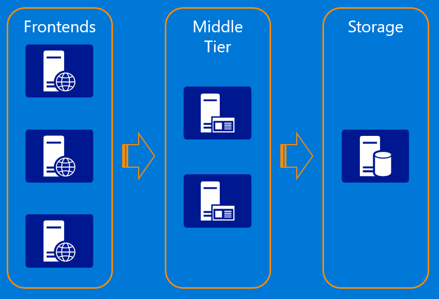
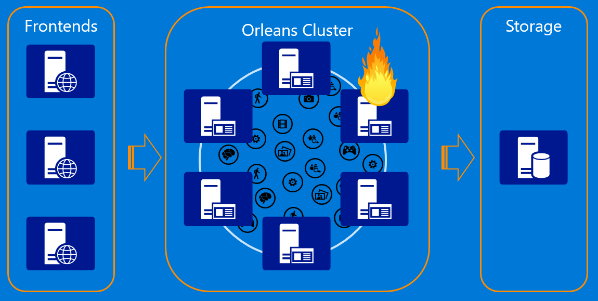

# Introduction

Orleans is a framework that provides a straightforward approach to building distributed high-scale computing applications without the need to learn and apply complex concurrency or other scaling patterns.

## Background

Cloud applications and services are inherently parallel and distributed.
They are also interactive and dynamic; often requiring near real time direct interactions among cloud entities.
Such applications are very difficult to build today.
The development process demands expert level programmers and typically requires expensive iterations of the design and the architecture, as the workload grows.

Most of today’s high scale properties are built as a composition of stateless n-tier services with most of the application logic residing in the middle tier.

While the model allows scaling out by adding more servers to the middle tier, it is constrained by the performance and scalability of the storage layer because most requests coming to the middle tier from the frontend web servers require one or more reads from storage. 
Updates are even more complicated and prone to concurrency issues and conflicts due to lack of coordination among the middle tier servers.
It often requires caching in the stateless layer to get acceptable performance, adding complexity and introducing cache consistency issues.
The other problem with the stateless n-tier model is that it doesn't support horizontal communications well among individual application entities exposed by the middle tier, which makes it hard to implement complex business logic with multiple entities performing individual operations as part of processing a request.

## Orleans as a Stateful Middle Tier

Orleans provides an intuitive way of building a stateful middle tier, where various business logic entities appear as sea of isolated globally addressable .NET objects (grains) of different application defined types distributed across a cluster of servers (silos).

A grain type is a simple .NET class that implements one or more application-defined grain interfaces.
Individual grains are instances of application-defined grain classes that get automatically created by the Orleans runtime on servers on an as-needed basis to handle requests for those grains.
Grains naturally map to most application entities, such as users, devices, sessions, inventories, and orders. 
This makes it very easy to build business logic that is object-oriented but scales transparently across a cluster of servers.
Each grain has a stable logical identity (key) within its grain type chosen by the application logic, for example, user email or device ID or inventory SKU code.
Orleans guarantees single-threaded execution of each individual grain, hence protecting the application logic from perils of concurrency and races.
In the world of microservices, Orleans is used as a framework for implementing a microservice that can be deployed and managed by a microservices deployment/management solution of developer's choice.

## Grain Lifecycle

A grain can have persistent state in storage, in-memory state, or both.
Any grain can be called by any other grain or by a frontend (client) by using the target grain's logical identity without the need to ever create or instantiate the target grain.
The Orleans programming model makes grains appear as if they are in memory the whole time.
In reality, a grain goes through the lifecycle from existing only as its persisted state in storage, to being instantiated in memory, to being removed from memory.
See also [Grain Lifecycle](/grains/grain_lifecycle.md).

Behind the scenes, the Orleans runtime instantiates (activates) grains when there's work for them to do, and removes them from memory (deactivates) to reclaim hardware resources when the grains are idle for too long.
This grain lifecycle management work of the runtime is transparent to the application code, and liberates it from the complicated task of distributed resource management.
Application logic can be written with the whole "address space" of grains available to it without the need to have hardware resources to keep all grains in memory at the same time, conceptually similar to how virtual memory works in operating systems.
In addition, the virtual nature of grains allows Orleans to handle server failures mostly transparently to the application logic because grains that were executing on a failed server get automatically re-instantiated on other servers in the cluster once the failure is detected.

## Virtual Actors

Implementation of Orleans is based on the Actor Model that's been around since the 1970s. 
However, unlike actors in more traditional actor systems such as Erlang or Akka, Orleans grains are virtual actors.
The biggest difference is that physical instantiations of grains are completely abstracted away and are automatically managed by the Orleans runtime.
The Virtual Actor Model is much more suitable for high-scale dynamic workloads like cloud services and is the major innovation of Orleans.
You can read more details in the [Technical Report on Orleans.](https://www.microsoft.com/en-us/research/publication/orleans-distributed-virtual-actors-for-programmability-and-scalability)

## Origin of Orleans

Orleans was created at [Microsoft Research and designed for use in the cloud](https://www.microsoft.com/en-us/research/publication/orleans-distributed-virtual-actors-for-programmability-and-scalability/).
Since 2011, it has been used extensively in the cloud and on premises by several Microsoft product groups, most notably by game studios, such as 343 Industries and The Coalition as a platform for cloud services behind Halo 4 and 5, and Gears of War 4, as well as by a number of other companies.

Orleans was open-sourced in January 2015, and attracted many developers that formed [one of the most vibrant open source communities in the .NET ecosystem](http://mattwarren.org/2016/11/23/open-source-net-2-years-later/).
In an active collaboration between the developer community and the Orleans team at Microsoft, features are added and improved on a daily basis.
Microsoft Research continues to partner with the Orleans team to bring new major features, such as [geo-distribution](https://www.microsoft.com/en-us/research/publication/geo-distribution-actor-based-services/), [indexing](https://www.microsoft.com/en-us/research/publication/indexing-in-an-actor-oriented-database/), and [distributed transactions](https://www.microsoft.com/en-us/research/publication/transactions-distributed-actors-cloud-2/), that are pushing the state of the art.
Orleans has become the framework of choice for building distributed systems and cloud services for many .NET developers.