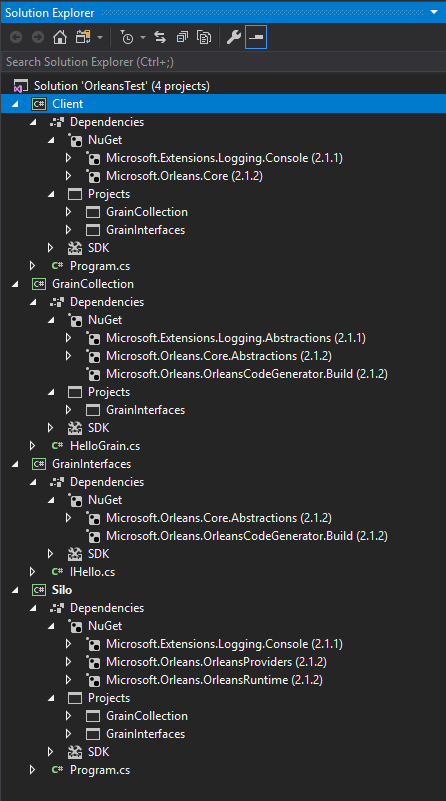

# Tutorial One - Creating a Minimal Orleans Application

This tutorial provides step by step instructions for creating a basic functioning Orleans application.
It is designed to be self-contained and minimalistic, with the following traits:

- It relies only on NuGet packages
- It has been tested in Visual Studio 2017 using Orleans 2.1.x
- It has no reliance on SQL or Azure

Keep in mind that this is only a tutorial and lacks appropriate error handling and other goodies that would be useful for a production environment.
However, it should help the readers get a real hands-on with regards to the structure of Orleans and allow them to focus their continued learning on the parts most relevant to them.

## Project Setup

For this tutorial we’re going to create 4 projects:

- a library to contain the grain interfaces
- a library to contain the grains
- a console application to host our Silo
- a console application to host our Client

After following this tutorial, the complete Solution should look like this:



### Create the structure in Visual Studio

Note: You can use the default project types in c# for each of these projects.
You will replace the default code with the code given for each project, below.
You will also probably need to add `using` statements, as needed.

1. Start by creating a console app project in a new solution. Call the project part `Silo` and name the solution `OrleansTest`.
2. Add another Console App project and name it `Client`.
3. Add a class library and name it `GrainInterfaces`.
4. Add another class library and name it `GrainCollection`.

#### Delete the Extras

1. Delete Class1.cs from GrainCollection
2. Delete Class1.cs from GrainInterfaces

### Add References

1. `GrainCollection` references `GrainInterfaces`.
2. `Silo` references `GrainInterfaces` and `GrainCollection`.
3. `Client` references `GrainInterfaces` and `GrainCollection`.

## Add Orleans via NuGet

The primary goodness is in `Microsoft.Orleans.Core`, but we will be including packages that provide additional functionality.  
Specifically, we will be using Template packages, which provide autocode generation for our grains and interfaces, and the Runtime which is used for hosting.

1. To the Silo project, add `Microsoft.Orleans.OrleansProviders`, `Microsoft.Orleans.OrleansRuntime`, and `Microsoft.Extensions.Logging.Console`.
2. To the Client project, add `Microsoft.Orleans.Core` and `Microsoft.Extensions.Logging.Console`.
3. To GrainInterfaces, add `Microsoft.Orleans.Core.Abstractions` and `Microsoft.Orleans.OrleansCodeGenerator.Build`.
4. To GrainCollection, add `Microsoft.Orleans.Core.Abstractions`, `Microsoft.Orleans.OrleansCodeGenerator.Build`, and `Microsoft.Extensions.Logging.Abstractions`.

## Create the Grain Interface

In GrainInterfaces, create an interface named `IHello.cs`.

Replace the default code with this:

``` csharp

    public interface IHello : Orleans.IGrainWithIntegerKey
    {
        Task<string> SayHello(string greeting);
    }

```

## Create the Grain

In GrainCollection, create a class named HelloGrain.cs and replace the default code with this:

``` csharp

    public class HelloGrain : Orleans.Grain, IHello
    {
        private readonly ILogger logger;

        public HelloGrain(ILogger<HelloGrain> logger)
        {
            this.logger = logger;
        }

        Task<string> IHello.SayHello(string greeting)
        {
            logger.LogInformation($"\n SayHello message received: greeting = '{greeting}'");
            return Task.FromResult($"\n Client said: '{greeting}', so HelloGrain says: Hello!");
        }
    }

```

### Create the Silo – Program.cs

This is a local deployment and there is more information about that in the [Local Development Configuration](http://dotnet.github.io/orleans/Documentation/clusters_and_clients/configuration_guide/local_development_configuration.html) page of the Orleans documentation.

``` csharp

 public class Program
    {
        public static int Main(string[] args)
        {
            return RunMainAsync().Result;
        }

        private static async Task<int> RunMainAsync()
        {
            try
            {
                var host = await StartSilo();
                Console.WriteLine("\n\n Press Enter to terminate...\n\n");
                Console.ReadLine();

                await host.StopAsync();

                return 0;
            }
            catch (Exception ex)
            {
                Console.WriteLine(ex);
                return 1;
            }
        }

        private static async Task<ISiloHost> StartSilo()
        {
            // define the cluster configuration
            var builder = new SiloHostBuilder()
                .UseLocalhostClustering()
                .Configure<ClusterOptions>(options =>
                {
                    options.ClusterId = "dev";
                    options.ServiceId = "OrleansTest";
                })
                .Configure<EndpointOptions>(options => options.AdvertisedIPAddress = IPAddress.Loopback)
                .ConfigureApplicationParts(parts => parts.AddApplicationPart(typeof(HelloGrain).Assembly).WithReferences())
                .ConfigureLogging(logging => logging.AddConsole());

            var host = builder.Build();
            await host.StartAsync();
            return host;
        }
    }

```

### Create the Client – Program.cs

There is more information about the client in the [Clusters and Clients](http://dotnet.github.io/orleans/Documentation/clusters_and_clients/index.html) section of the Orleans documentation.

``` csharp

 public class Program
    {
        const int initializeAttemptsBeforeFailing = 5;
        private static int attempt = 0;

        static int Main(string[] args)
        {
            return RunMainAsync().Result;
        }

        private static async Task<int> RunMainAsync()
        {
            try
            {
                using (var client = await StartClientWithRetries())
                {
                    await DoClientWork(client);
                    Console.ReadKey();
                }

                return 0;
            }
            catch (Exception e)
            {
                Console.WriteLine(e);
                Console.ReadKey();
                return 1;
            }
        }

        private static async Task<IClusterClient> StartClientWithRetries()
        {
            attempt = 0;
            IClusterClient client;
            client = new ClientBuilder()
                .UseLocalhostClustering()
                .Configure<ClusterOptions>(options =>
                {
                    options.ClusterId = "dev";
                    options.ServiceId = "OrleansTest";
                })
                .ConfigureLogging(logging => logging.AddConsole())
                .Build();

            await client.Connect(RetryFilter);
            Console.WriteLine("Client successfully connected to silo host \n");
            return client;
        }

        private static async Task<bool> RetryFilter(Exception exception)
        {
            if (exception.GetType() != typeof(SiloUnavailableException))
            {
                Console.WriteLine($"Cluster client failed to connect to cluster with unexpected error.  Exception: {exception}");
                return false;
            }
            attempt++;
            Console.WriteLine($"Cluster client attempt {attempt} of {initializeAttemptsBeforeFailing} failed to connect to cluster.  Exception: {exception}");
            if (attempt > initializeAttemptsBeforeFailing)
            {
                return false;
            }
            await Task.Delay(TimeSpan.FromSeconds(4));
            return true;
        }

        private static async Task DoClientWork(IClusterClient client)
        {
            // example of calling grains from the initialized client
            var friend = client.GetGrain<IHello>(0);
            var response = await friend.SayHello("Good morning, HelloGrain!");
            Console.WriteLine("\n\n{0}\n\n", response);
        }
    }

```

## Run the application

Build the solution and run the Silo.
After you get the confirmation message that the Silo is running ("Press enter to terminate..."), run the Client.
Success looks like this:


Within the appropriate bin directory (Debug/Release) there will be a number of log files showing this information as well.
The amount and method of logging is configurable.

## Further Reading

 - [List of Orleans Packages](http://dotnet.github.io/orleans/Documentation/core_concepts/what_are_orleans_packages.html)
 - [Orleans Configuration Guide](http://dotnet.github.io/orleans/Documentation/clusters_and_clients/configuration_guide/index.html)
 - [Orleans Best Practices](https://www.microsoft.com/en-us/research/publication/orleans-best-practices)
