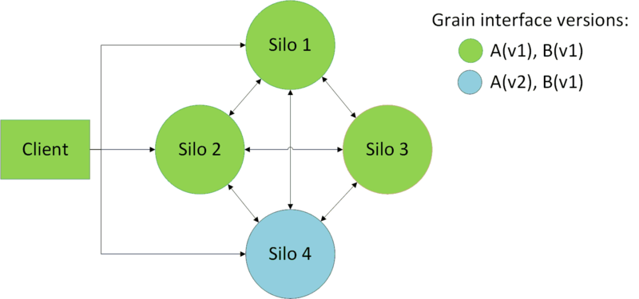

[!include[](../../warning-banner.md)]

# Grain versioning

> [!WARNING]
> This page describes how to use grain interface versioning. The versioning of
> Grain state is out of scope.

## Overview
On a given cluster, silos can support different versions of a grain type.

In this example the client and Silo{1,2,3} were compiled with grain interface `A` version 1. Silo 4 was compiled with `A` version 2.

## Limitations:
-	No versioning on stateless worker
-	Streaming interfaces are not versioned

## Enable versioning
By default, grains are not versioned. You can version grain by using the VersionAttribute on the grain interface:

``` cs
[Version(X)]
public interface IVersionUpgradeTestGrain : IGrainWithIntegerKey {}
```

Where `X` is the version number of the grain interface, which is typically monotonically increasing.

## Grain version compatibility and placement
When a call from a versioned grain arrive in a cluster:
- If no activation exists, a compatible activation will be created
- If an activation exists:
  - If the current one is not compatible, it will be deactivated and new compatible will be created (see [version selector strategy](Version-selector-strategy.md))
  - If the current one is compatible (see [compatible grains](Compatible-grains.md)), the call will be handled normally.

By default:
- All versioned grains are supposed to be backward-compatible only (see [backward compatibility guidelines](Backward-compatibility-guidelines.md) and [compatible grains](Compatible-grains.md)). That means that a v1 grain can make calls to a v2 grain, but a v2 grain cannot call a v1. This default behavior can be changed with `GlobalConfiguration.DefaultCompatibilityStrategy`
- When multiple versions exist in the cluster, the new activation will be randomly placed on a compatible silo. This default behavior can be changed with `GlobalConfiguration.DefaultVersionSelectorStrategy`
