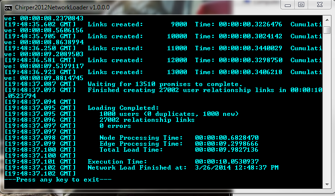
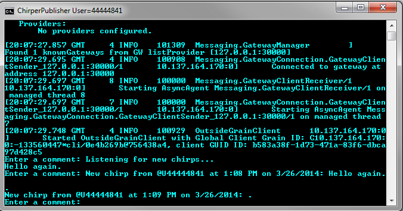

[!include]

# Chirper

A simple social network pub/sub system, with short text messages being sent between users. Publishers send out short "Chirp" messages (not to be confused with "Tweets", for a variety of legal reasons! ;) to any other users that are following them.

### Instructions
1. Build Chirper.sln
2. Start your local Silo from a command window using command file  #1.
3. The loader script, #2
4. Start the Chirper client #3
5. Start a second Chirper client as a publisher #4
6. Type a comment into the publisher client window, and see it displayed on the other client console window.

### Overview
The `NetworkLoader` program reads a graphml data file containing a description of a network of Users and Followers.

The `NetworkLoader` program sets up a network of  `ChirperAccount` (aka "users") grains based on the input data file, one grain for each user defined in the network. It then creates the follower links between those users by calling the FollowUserId method on the appropriate user grain.

For this demo, we use a simplified network of 1,000 Users with a total of 27,000 Follower links connecting those Users, but other network data files can be created with the NetworkGenerator program, or with a normal text / XML editor.

 The ChirperClient program connects to the Chirper network as a user specified on the cmd line. It then listens for any new Chirps that might be sent out by the other users they follow.

When you type a comment into the publisher window, the text is sent as a Chirp message to all followers of that user, including the first client console window, as well as being echo'ed on the publisher's window.

### Why Orleans?
Orleans allows the network of Chirper users to be described via very simple C# code whilst allowing it to easily scale out to handle increasing number of users and volume of chirp messages.

### How is it modeled?
Chirper users are modeled as grains, which provides a very natural mapping of concepts.

These grains allow to distribute the load for handling the message throughput, with each grain handling the forwarding of messages generated by that user to any other users that are following them.

The grains implement three different grain interfaces to represent the three functional facets of those entities -- `IChirperPublisher`, `IChirperSubscriber` and `IChirperAccount`

There is also an `IChirperViewer` observer interface for applications to subscribe for status changes from a particular Chirper user without becoming a Follower. This observer interface is typically used when writing client UI applications such as `ChirperClient`.

### Things for you to do if you are so inclined:

1. Connect more clients to see the Chirper broadcast behavior.
2. Make the network of users much bigger.
3. Make the rate of generating messages higher.
