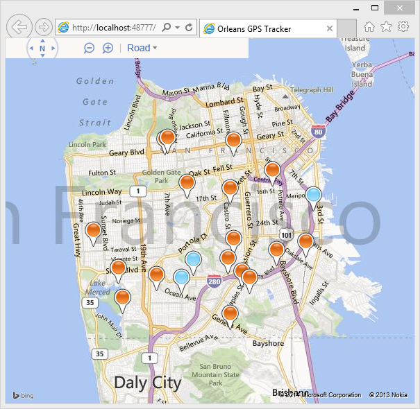

[!include]

# GPS Tracker

A sample application to show how Orleans could be used in conjunction with [SignalR](https://orleans.codeplex.com/wikipage?title=https%3a%2f%2fgithub.com%2fSignalR%2fSignalR&referringTitle=GPS%20Tracker) to monitor the position of a number of GPS enabled devices, and report these to a web browser.

In order to run this sample, you need a Bing Maps API key. The key is used by the `GPSTracker.Web` project, in Views\Home\Index.cshtml.

[Get a Bing Maps Key](http://msdn.microsoft.com/en-us/library/ff428642.aspx)

### Running the Sample

Running the sample locally:

1. Open the `GPSTracker.sln` file in Visual Studio 2013, and build the solution.
2. Start the local Orleans Silo by running the `Host` project of the solution.
3. In Visual Studio, right click on the `GPSTracker.Web` project, and click `Set as StartUp Project`.
4. Press F5 to start `GPSTracker.Web` web application.
5. Your browser should open on a map of San Francisco.
6. In a command window, navigate to the `GPSTracker.FakeDeviceGateway\bin\Debug` directory, and run the 'GPSTracker.FakeDeviceGateway.exe' program.
7. Pushpins should appear on the map, and move around. Blue ones are moving slow, orange faster.

### How it Works
The `GPSTracker.FakeDeviceGateway.exe` program simulates data generated from 20 GPS devices. It randomly alters their speed and heading to simulate the devices moving within rectangular boundaries. It sends the position data to Orleans once a second.

In Orleans, each device is represented by a `Device` grain. The grain records the previous position of the device, and can therefore calculate the speed of the device. If the devices has moved, the 'Device' grain forwards position and speed to a `PushNotification` grain.

This 'PushNotification' grain maintains a C# SignalR client, which connects to a SignalR hub hosted in the `GPSTracker.Web` project. This allows the grain to 'push' messages to the hub without the need for polling the Orleans API. The grain will batch messages together to improve network performance.

The `GPSTracker.Web` application forwards all messages to connected web browsers using SignalR.

JavaScript running in the browser positions the pins using a Bing Maps control. If the pin has a low velocity it colors it blue, otherwise orange.

### Advantages of using Orleans
This sample is designed to show Orleans as a low-latency messaging system. Orleans is able to hold state for each device in memory (of which there may be many), allowing a quick calculation to be performed (calculating velocity) based on previous state.

The grain in Orleans can also decide whether the message is worthy of forwarding downstream (has the device moved?) and can therefore filter out unnecessary messages and reduce noise.

The sample also illustrates how SignalR may be used from inside a grain to allow 'push' messaging directly to clients.

In a real life scenario you would probably not forward all messages to the browser, and would filter based on groups or device type.
