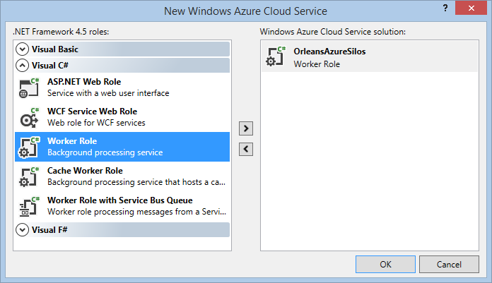

# Cloud Deployment

## Deploying Orleans to Windows Azure
This walkthrough shows the steps required to deploy the sample created in the  [Front Ends for Orleans Services](Front-Ends-for-Orleans-Services.md) to Windows Azure Cloud Services.

In Azure, one or more worker roles will be used to host the Orleans silos, and an Azure web role will act as the presentation layer for the application and client to the application grains running in the Orleans silos.

The same grain interfaces and implementation can run on both Windows Server and Windows Azure, so no special considerations are needed in order to be able to run your application in a Windows Azure hosting environment.

The  [Azure Web Sample](https://github.com/dotnet/orleans/tree/master/Samples/AzureWebSample) sample app provides a working example of how to run a web application with supporting Orleans silo cluster backend in an Azure hosted service, and the details are described below.

## Pre-requisites
The following prerequisites are required:

* Visual Studio 2013 or 2015
* [Windows Azure SDK v2.4 or higher](https://azure.microsoft.com/en-us/downloads/)

For more info on installing and working with Windows Azure in general, see the Microsoft Azure documentation web site: (https://docs.microsoft.com/en-us/azure/)

## Create Azure Worker Role for Orleans Silos
Right click on your solution, and select 'Add | New Project...'.

Choose the 'Windows Azure Cloud Service' project template:


When prompted, select a new 'Worker Role' to add to the project.
This will be used to host the Orleans Silos:



## Add project references for Orleans Silo binaries
Add references to the `OrleansAzureSilo` project for the required Orleans server library files.
Copies of these files can be found in the _.\Binaries\OrleansServer_ folder under the Orleans SDK.

* Orleans.dll
* OrleansAzureUtils.dll
* OrleansRuntime.dll
* OrleansProviders.dll (Only required if you your grains use the [Declarative Persistence](Declarative-Persistence.md) functionality.)

Note: All of these references MUST have _Copy Local = 'True'_ settings to ensure the necessary library DLLs get copied into the `OrleansAzureSilo` project output directory.


## Configure Azure Worker Role for Orleans Silos
The Worker Role initialization class is a normal Azure worker role - it needs to inherit from the usual `Microsoft.WindowsAzure.ServiceRuntime.RoleEntryPoint` base class.

The worker role initialization class needs to create an instance of `Orleans.Runtime.Host.AzureSilo` class, and call the appropriate `Start`/`Run`/`Stop` functions in the appropriate places:

``` csharp
public class WorkerRole : RoleEntryPoint
{
    AzureSilo silo;

    public override bool OnStart()
    {
        // Do other silo initialization – for example: Azure diagnostics, etc

        return base.OnStart();
    }

    public override void OnStop()
    {
        silo.Stop();
        base.OnStop();
    }

    public override void Run()
    {
        var config = AzureSilo.DefaultConfiguration();
        config.AddMemoryStorageProvider();
        config.AddAzureTableStorageProvider("AzureStore", RoleEnvironment.GetConfigurationSettingValue("DataConnectionString"));

        // Configure storage providers

        silo = new AzureSilo();
        bool ok = silo.Start(config);

        silo.Run(); // Call will block until silo is shutdown
    }
}
```

It is IMPORTANT to start the silo not in OnStart but in Run. Azure may not have the firewalls open yet (on the remote silos) at the OnStart phase.

Then, in the `ServiceDefinition.csdef` file for this role, add some required configuration items used by the Orleans Azure hosting library to the WorkerRole configuration:

* Add a `ConfigurationSettings` declaration named 'DataConnectionString'. This is the Azure storage location where Orleans Azure hosting library will place / look for its silo instance table.
* Add an `InternalEndpoint` declaration for a TCP endpoint named 'OrleansSiloEndpoint'
* Add an `InternalEndpoint` declaration for a TCP endpoint named 'OrleansProxyEndpoint'

```xml
<ServiceDefinition ...>
    <WorkerRole name="OrleansAzureSilos" ...>
        ...
        <ConfigurationSettings>
            <Setting name="Microsoft.WindowsAzure.Plugins.Diagnostics.ConnectionString" />
            <Setting name="DataConnectionString" />
        </ConfigurationSettings>
        <Endpoints>
            <InternalEndpoint name="OrleansSiloEndpoint" protocol="tcp" port="11111" />
            <InternalEndpoint name="OrleansProxyEndpoint" protocol="tcp" port="30000" />
        </Endpoints>
        ...
    </WorkerRole>
    ...
</ServiceDefinition>
```


In the _ServiceConfiguration.cscfg_ file for this role, add some required configuration items used by the Orleans Azure hosting library:

Add a `ConfigurationSettings` definition for 'DataConnectionString'

This will be a normal Azure storage connection – either for the development storage emulator (only valid if running locally), or a full Azure storage account connection string for cloud-storage.

In general, this connection string is likely to use the same configuration values as the `Microsoft.WindowsAzure.Plugins.Diagnostics.ConnectionString` diagnostics connection string setting, but is not required to. Be careful to not mix up Azure storage and local storage. This can cause deployments to not work.

See the [Configure Azure Storage Connection Strings](https://docs.microsoft.com/en-us/azure/storage/storage-configure-connection-string) for more information.

For example, to use local Developer Storage emulator (for local testing only)

```xml
<ConfigurationSettings>
    <Setting name="Microsoft.WindowsAzure.Plugins.Diagnostics.ConnectionString" value="UseDevelopmentStorage=true" />
    <Setting name="DataConnectionString" value="UseDevelopmentStorage=true" />
</ConfigurationSettings>
```

Or using an Azure cloud storage account:

```xml
<ConfigurationSettings>
    <Setting name="Microsoft.WindowsAzure.Plugins.Diagnostics.ConnectionString" value="DefaultEndpointsProtocol=https;AccountName=MyAccount;AccountKey=MyKey" />
    <Setting name="DataConnectionString" value="DefaultEndpointsProtocol=https;AccountName=MyAccount;AccountKey=MyKey" />
</ConfigurationSettings>
```

## Changing DataConnectionString
The "DataConnectionString" setting in `ServiceDefinition.csdef` is the default name use by the Orleans silo for the Azure table account connection string that will be used for Orleans system tables such as `OrleanSiloInstances`.

If you wish to use a different setting name for this value, then in the silo role initialization code set the property `OrleansAzureSilo.DataConnectionConfigurationSettingName` before the call to `OrleansAzureSilo.Start(...)`

## Add your grain binaries to Azure Worker Role for Orleans Silos
Add the grain interfaces DLL and implementation classes DLL for the grains to be hosted in the Azure silo into the `OrleansAzureSilo` project, along with any supporting libraries those grains need.


Note: You MUST ensure that all the referenced binaries are copied into the `OrleansAzureSilo` project output directory, to ensure they get picked up by the Azure packaging tools.


## Running Orleans Client as Azure Web Role
The user interface / presentation layer for your application will usually run as a Web Role in Azure.

The `Orleans.Runtime.Host.AzureClient` utility class is the main mechanism for bootstrapping connection to the Orleans silo worker roles from an Azure Web Role.
A few additional configuration steps are needed to make the `AzureClient` utility class work – see below for details.

### Create Azure Web Role for Orleans Client

Any type of web role can be used as an Orleans client, and there are no specific naming requirements or conventions for this project.

Add a web role to the solution using the existing web application project that we created in the Front Ends for Orleans Services tutorial.

Add project references for Orleans Client binaries.
Add references to the web role project for the required Orleans client library files.
Copies of these files can be found in either  _SDK-ROOT\Samples\References_ or  _SDK-ROOT\Binaries\OrleansClient_ directories.

* Orleans.dll
* OrleansAzureUtils.dll


Note: All of these references MUST have _Copy Local = 'True'_ settings to ensure the necessary library DLLs get copied into the web role project output directory.


###Configure Azure Web Role to be an Orleans Client
In the `ServiceDefinition.csdef` file for this web role, add some required configuration items used by the Orleans Azure hosting library:

* Add a `ConfigurationSettings` declaration named 'DataConnectionString'.
This is the Azure storage location where Orleans Azure hosting library will place / look for its silo instance table.
* In addition, a http/s `InputEndpoint` will also need to be declared, just as for any other Azure web role config.

```xml
<ServiceDefinition ...>
<WebRole name="MyWebRole" ...>
    ...
    <Sites>
      <Site name="Web">
        <Bindings>
            <Binding name="Endpoint1" endpointName="Endpoint1" />
        </Bindings>
      </Site>
    </Sites>
    <ConfigurationSettings>
        <Setting name="Microsoft.WindowsAzure.Plugins.Diagnostics.ConnectionString" />
        <Setting name="DataConnectionString" />
    </ConfigurationSettings>
    <Endpoints>
        <InputEndpoint name="Endpoint1" protocol="http" port="80" />
    </Endpoints>
    ...
</WebRole>
...
</ServiceDefinition>
```

In the _ServiceConfiguration.cscfg_ file for this role, add some required configuration items used by the Orleans Azure hosting library:

Add a `ConfigurationSettings` definition for 'DataConnectionString'.
This will be a normal Azure storage connection – either for the development storage emulator (if running locally), or a full Azure storage account connection string for cloud-storage.

This setting MUST match the `DataConnectionString` value used by the `OrleansSiloWorker` role in order for the client to discover and bootstrap the connection to the Orleans silos.

For example, to use local Developer Storage emulator (for local testing only)

```xml
<ServiceConfiguration ...>
<Role name="OrleansWebClient" ...>
    ...
    <ConfigurationSettings>
        <Setting name="Microsoft.WindowsAzure.Plugins.Diagnostics.ConnectionString" value="UseDevelopmentStorage=true" />
        <Setting name="DataConnectionString" value="UseDevelopmentStorage=true" />
    </ConfigurationSettings>
    ...
</Role>
...
</ServiceConfiguration>
```

Or using an Azure cloud storage account:

```xml
<ServiceConfiguration ...>
<Role name="OrleansWebClient" ...>
    ...
    <ConfigurationSettings>
        <Setting name="Microsoft.WindowsAzure.Plugins.Diagnostics.ConnectionString" value="DefaultEndpointsProtocol=https;AccountName=MyAccount;AccountKey=MyKey" />
        <Setting name="DataConnectionString"    value="DefaultEndpointsProtocol=https;AccountName=MyAccount;AccountKey=MyKey" />
    </ConfigurationSettings>
    ...
</Role>
...
</ServiceConfiguration>
```


### Add your grain interface binaries to Azure Web Role for Orleans Client
Add the grain interfaces DLL for the application grains into this web role project.

Access to the DLL containing the grain implementation classes should not be required by the client web role.

Note: You MUST ensure that all the referenced binaries for grain interfaces and the generated proxy / factory libraries are copied into the web role project output directory, to ensure they get picked up by the Azure packaging tools.

The grain implementation DLLs should not be required by the client and so should not be referenced by the web role.

## Initialize Client Connection to Orleans Silos
It is recommended to bootstrap and initialize the client connection to the Orleans silo worker roles, to ensure a connection is set up before use in the _Global.asax_ initialization methods.

Edit the configuration of the client in the _Global.asax.cs_ file to use `AzureClient`.

``` csharp
namespace WebApplication1
{
    public class WebApiApplication : System.Web.HttpApplication
    {
        protected void Application_Start()
        {
            ...
            var config = AzureClient.DefaultConfiguration();

            // Attempt to connect a few times to overcome transient failures and to give the silo enough 
            // time to start up when starting at the same time as the client (useful when deploying or during development).
            const int initializeAttemptsBeforeFailing = 5;

            int attempt = 0;
            while (true)
            {
                try
                {
                    AzureClient.Initialize(config);
                    break;
                }
                catch (SiloUnavailableException e)
                {
                    attempt++;
                    if (attempt >= initializeAttemptsBeforeFailing)
                    {
                         throw;
                    }
                    Thread.Sleep(TimeSpan.FromSeconds(2));
                }
            }
       	   ...
```

Repeated calls to `AzureClient.Initialize()`  will return and do nothing if the Orleans client connection is already set up.

An additional variant of `AzureClient.Initialize(System.IO.FileInfo)` allows a base client config file location to be specified explicitly.
The internal endpoint addresses of the Orleans silo nodes will still be determined dynamically from the Orleans Silo instance table each silo node registers with.

<!--TODO: Create link to Orleans API when the link is created/found-->
See the Orleans API docs for details of the various `Initialize` methods available.

## Deploying to Azure
The normal Azure deployment tools are used to deploy the application to Windows Azure – either into the local Azure Compute Emulator for local development / test (Press F5 to run), or into the Azure cloud hosting environment right click on the Cloud project and select 'Publish':

## Next

Let's look at the steps required to run Orleans on Windows Server:

[On-Premise Deployment](On-Premise-Deployment.md)
