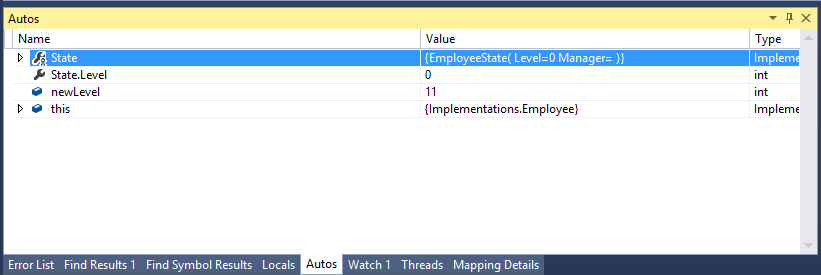
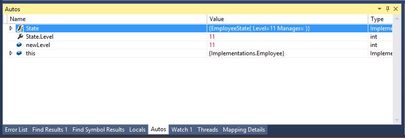
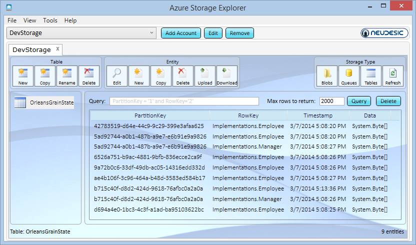

# Declarative Persistence

In the second tutorial, we saw how grain state survived the client being shut down, which opens up for a lot of cache-like scenarios, where Orleans is relied upon as a kind of 'cache with behavior,' an object-oriented cache, if you will.
That is already very valuable and goes a long way toward achieving server-side scalability with a simple, familiar, programming model and the built-in single-threaded execution guarantees.

However, it is sometimes the case that some of the state you are accumulating belongs in some form of permanent storage, so that it can survive a silo shutdown, or a grain migrating from one silo to another for load-balancing or a complete restart/shutdown of the service. What we have seen so far will not support such situations.

Fortunately, Orleans offers a simple declarative model for identifying the state that needs to be stored in a permanent location, while leaving the decision when to save and restore state under programmatic control.
You are not required to use the declarative persistence mechanism and can still access storage directly from your grain code, but it’s a nice way to save you some boilerplate code and build applications that are portable across various storage services.

## Getting Started
We'll continue to build on our employee-and-manager sample.

The first thing we need to do is make the identities of our workers and managers a little more predictable.
In the sample, they were assigned GUIDs using `Guid.NewGuid()`, which is convenient, but doesn't let us find them in a subsequent run.
Therefore, we'll create a set of GUIDs first, then use them as the worker identities.

The modified `Main` program looks like this:

``` csharp
static void Main(string[] args)
{
     ...
    var ids = new string[] {
        "42783519-d64e-44c9-9c29-399e3afaa625",
        "d694a4e0-1bc3-4c3f-a1ad-ba95103622bc",
        "9a72b0c6-33df-49db-ac05-14316edd332d",
        "6526a751-b9ac-4881-9bfb-836ecce2ca9f",
        "ae4b106f-3c96-464a-b48d-3583ed584b17",
        "b715c40f-d8d2-424d-9618-76afbc0a2a0a",
        "5ad92744-a0b1-487b-a9e7-e6b91e9a9826",
        "e23a55af-217c-4d76-8221-c2b447bf04c8",
        "2eef0ac5-540f-4421-b9a9-79d89400f7ab"
    };

    var e0 = GrainClient.GrainFactory.GetGrain<IEmployee>(Guid.Parse(ids[0]));
    var e1 = GrainClient.GrainFactory.GetGrain<IEmployee>(Guid.Parse(ids[1]));
    var e2 = GrainClient.GrainFactory.GetGrain<IEmployee>(Guid.Parse(ids[2]));
    var e3 = GrainClient.GrainFactory.GetGrain<IEmployee>(Guid.Parse(ids[3]));
    var e4 = GrainClient.GrainFactory.GetGrain<IEmployee>(Guid.Parse(ids[4]));

    var m0 = GrainClient.GrainFactory.GetGrain<IManager>(Guid.Parse(ids[5]));
    var m1 = GrainClient.GrainFactory.GetGrain<IManager>(Guid.Parse(ids[6]));
    ...
}
```

Next, we'll do some silo configuration, in order to configure the storage provider that will give us access to persistent storage.
The silo host project includes a file _OrleansHostWrapper.cs_ which is where we find the following section:

```csharp
var config = ClusterConfiguration.LocalhostPrimarySilo();
config.AddMemoryStorageProvider();

// Add this line to use the Azure storage emulator
// config.AddAzureTableStorageProvider("AzureStore", "UseDevelopmentStorage=true");
// Add this line to use an Azure storage account
// config.AddAzureBlobStorageProvider("AzureStore", "[insert data connection string]");

siloHost = new SiloHost(siloName, config);
```

If this is hosted in Azure Cloud Services, then one can use:

```csharp
config.AddAzureBlobStorageProvider("AzureStore");
```

and it will pick up the same connection string used in `config.Globals.DataConnectionString`.

The `MemoryStorage` provider is fairly uninteresting, since it doesn't actually provide any permanent storage; it's intended for debugging persistent grains while having no access to a persistent store.
In our case, that makes it hard to demonstrate persistence, so we will rely on a real storage provider.

Depending on whether you have already set up (and want to use) an Azure storage account, or would like to rely on the Azure storage emulator, you should add one of the other two lines, but not both. You can use either the `AddAzureTableStorageProvider()` function or the `AddAzureBlobStorageProvider()` function depending on how you want to store information.

In the case of the former, you have to start the Azure storage emulator after installing the latest version of the Azure SDK.
In the case of the latter, you will have to create a Azure storage account and enter the name and keys in the configuration file.

With one of those enabled, we're ready to tackle the grain code.

> Note: The built-in storage provider classes `Orleans.Storage.AzureBlobStorage` and `Orleans.Storage.AzureTableStorage`
are in the  _OrleansAzureUtils.dll_ assembly, make sure this assembly is referenced in your silo worker role project
with _CopyLocal='True'_.

## Declaring State

Identifying that a grain should use persistent state takes three steps:

1. declaring a class for the state,
2. changing the grain base class, and
3. identifying the storage provider.

The first step, declaring a state class in the grain implementations project, simply means identifying the information of an actor that should be persisted and creating what looks like a record of the persistent data -- each state component is represented by a property with a getter and a setter.

For employees, we want to persist all the state:

``` csharp
public class  EmployeeState
{
    public int Level { get; set; }
    public IManager Manager { get; set; }
}
```

and for managers, we must store the direct reports, but the `_me` reference may continue to be created during activation.

``` csharp
public class ManagerState
{
    public List<IEmployee> Reports { get; set; }
}
```

Then, we change the grain class declaration to identify the state interface (e.g., from `Orleans.Grain` to `Orleans.Grain<EmployeeState>`) and remove the variables that we want persisted. Make sure to remove `level`, and `manager` from the `Employee` class and `_reports` from the `Manager` class. In addition, we must update the other functions to reflect these removals.

 We also add an attribute to identify the storage provider:

``` csharp
[StorageProvider(ProviderName = "AzureStore")]
public class Employee : Orleans.Grain<EmployeeState>, Interfaces.IEmployee
```

and


``` csharp
[StorageProvider(ProviderName="AzureStore")]
public class Manager : Orleans.Grain<ManagerState>, IManager
```

At risk of stating the obvious, the name of the storage provider attribute should match the name in the configuration file.
This indirection is what allows you to delay choices around where to store grain state until deployment.

Given these declarative changes, the grain should no longer rely on a private fields to keep compensation level and manager.
Instead, the grain base class gives us access to the state via a `State` property that is available to the grain.

For example:

``` csharp
public Task SetManager(IManager manager)
{
   State.Manager = manager;
   return TaskDone.Done;
}
```

## Controlling Checkpoints

The question that remains is when the persistent state gets saved to the storage provider.

One choice that the Orleans designers could have made would be to have the runtime save state after every method invocation, but that turns out to be undesirable because it is far too conservative -- not all invocations will actually modify the state on all invocations, and some will never modify it. Rather than employing a complex system to evaluate state differentials after each method, Orleans asks the grain developer to add the necessary logic to determine whether state needs to be saved or not.

Saving the state using the storage provider is easily accomplished by calling `base.WriteStateAsync()`.

Thus, the final version of the `Promote()` and `SetManager()` methods looks like this:

``` csharp
public Task Promote(int newLevel)
{
    State.Level = newLevel;
    return base.WriteStateAsync();
}

public Task SetManager(IManager manager)
{
    State.Manager = manager;
    return base.WriteStateAsync();
}
```

In the `Manager` class, there's only one method that need to be modified to write out data, `AddDirectReport()`.
It should look like this:

``` csharp
public async Task AddDirectReport(IEmployee employee)
{
    if (State.Reports == null)
    {
        State.Reports = new List<IEmployee>();
    }
    State.Reports.Add(employee);
    await employee.SetManager(this);
    var data = new GreetingData { From = this.GetPrimaryKey(), Message = "Welcome to my team!" };
    await employee.Greeting(data);
    Console.WriteLine("{0} said: {1}",
                        data.From.ToString(),
                        data.Message);

    await base.WriteStateAsync();
}
```

Let's try this out!

Set a breakpoint in `Employee.Promote()`.

When we run the client code the first time and hit the breakpoint, the level field should be `0` and the newLevel parameter either `10` or `11`:



Let the application finish (reach the 'Hit Enter...' prompt) and exit.
Run it again, and compare what happens when you look at state this second time around:




## Just Making Sure...

It's worth checking what Azure thinks about the data.
Using a storage explorer such as Azure Storage Explorer (ASE) or the one built in to Server Explorer in Visual Studio 2013, open the storage account (or developer storage of the emulator) and find the 'OrleansGrainState' table.
It should look something like this (you have to hit 'Query' in ASE):



If everything is working correctly, the grain keys should appear in the `PartitionKey` column, and the qualified class name of the grains should appear in the `RowKey` column.

## Mixing Things

A grain may contain a combination of persisted and transient state.
Any transient state should be represented by private fields in the grain class.
A common use for mixing the two is to cache some computed version of the persisted state in private fields while it is present in memory.
For example, a stack of elements may be externally represented as a `List<T>`, but internally, as a `Stack<T>`.

In the case of our `Manager` class, the `_me` field is simply a cached value, something we don't even need to keep as a field in the first place, it can be created any time we need it, but since it's going to be a commonly used value, it's worth keeping it around in a transient field.

## Automatic loading of state

If a grain type has state, at activation time the state will be loaded from storage and then `OnActivateAsync` is called so you can be sure that the state is loaded when initializing your grain. This is the only case that Orleans calls `ReadStateAsync` automatically. If you want to write the state or read it in some other place, you should do it on your own. Normally you should not need to call `ReadStateAsync` yourself unless you are doing something specific regarding handling corrupted state or something else.

## Handling failures using persistence

Generally speaking reading and writing a grain's state is a good mechanism to handle failures as well as serving its original intent.
There is a possibility that your grain call fails in the middle of a method due to different reasons and you end up with a state which is half changed.
In this case reading from storage can return your state to the last correct state.
Alternatively, having gotten into such a state, the grain can request to get immediately deactivated by calling  DeactivateOnIdle(), so that its a next request to it would trigger reactivation of the grain, which would reread the persistent state and reconstruct its in-memory copy.
Deactivation is the cleanest way of resetting a grain to its last know good state, but if you want to avoid the cost of the reactivation process, you can reset its state and rerun any initialization logic (for example, by calling `OnActivateAsync`) instead of deactivating the grain.

## Next

Next, we'll see how we can call our grains from an MVC web application.

[Handling Failure](Failure-Handling.md)
