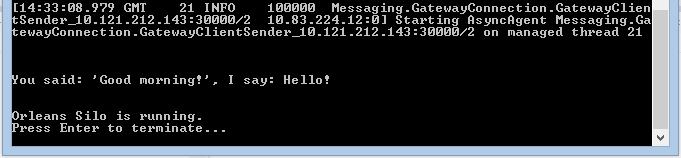

# On-Premise Deployment

## Overview

While using Orleans to implement cloud-based services is a core scenario, there is nothing that intrinsically ties it to the cloud as the sole platform.
Orleans can just as well be deployed to the internal, on-premise, equipment of your organization's.
In this tutorial, we describe the steps to take.

Orleans based services are xcopy-deployable.
All you need to do to deploy an Orleans based service to a set of machines is copy the following set of file to the target machines and start the _OrleansHost.exe_ host process:

* Contents of the build folder of your host project (it can use `Microsoft.Orleans.Host` NuGet package or use your own console application running the Silo).
* _OrleansConfiguration.xml_ file with configuration for the deployment to replace the default placeholder (If you use file based config).
* Binaries with grain interfaces and grain implementation classes of the service along with any external dependencies to _Application\<service name>_ subdirectory of the folder on the target with binaries of the host which should contain Orleans DLLs as well.

This simple task may be accomplished in many different ways and with different tools, but the Orleans GitHub repo includes a set of PowerShell scripts (https://github.com/dotnet/orleans/tree/master/misc/scripts/RemoteDeployment) that provide a way to deploy an Orleans based service to a cluster of machines and remote start the hosting processes on them.
There are also scripts for removing a service, monitoring its performance, starting and stopping it, and collecting logs.
These are the scripts we found useful for ourselves while building and testing Orleans.

## Prerequisites
The following table lists the prerequisites for deploying and running Orleans on a remote machine:

### .Net Framework 4.5

Orleans runs under the .Net Framework 4.5, which can be installed from this link: (https://www.microsoft.com/en-us/download/details.aspx?id=30653)

### Powershell 2.0 with WinRM

Windows 7 and Windows Server 2008 R2 should have these installed by default.
For earlier versions of Windows, select the appropriate download from this article: (https://support.microsoft.com/en-us/help/968929/windows-management-framework-windows-powershell-2.0,-winrm-2.0,-and-bits-4.0).
To confirm you are running the required version of PowerShell, start a PowerShell window and type `Get-Host` – the resulting output needs to say "Version: 2.0"

### WinRM Configuration

Both the source and target machines must be configured for remote operations: Open a PowerShell window as an Administrator and run the command below on the target machine (enter 'y' at the prompts):

     winrm quickconfig

### Increase PowerShell job memory

Set the memory limit on remotely invoked jobs to 4Gb:

    Set-Item wsman:localhost\Shell\MaxMemoryPerShellMB 4096

To change it on a remote machine, use the following steps:

    Connect-WSMan -ComputerName <string>
    Set-Item wsman:<computerName>\Shell\MaxMemoryPerShellMB
    Disconnect-WSMan –ComputerName <string>

### PowerShell Execution Policy set to run remote scripts

Open a PowerShell window as an Administrator and run the command below on the target machine (enter 'y' at the prompt):

    Set-ExecutionPolicy RemoteSigned

This will set the machine to require signing for remote scripts only.

Note that the user running the scripts must be a member of the Administrators Group on the remote machines.

## Deployment Steps
In this tutorial , we will deploy the _HelloWorld_ sample to a set of servers.
The Orleans repo includes a _RemoteDeployment_ folder (https://github.com/dotnet/orleans/tree/master/misc/scripts/RemoteDeployment) where everything we need can be found.
Start by building the [Hello World sample](../Documentation/Samples-Overview/Hello-World.md), commenting out (or removing) the silo initialization and shutdown code:

``` csharp
static void Main(string[] args)
{
    //AppDomain hostDomain =
    //    AppDomain.CreateDomain("OrleansHost", null, new AppDomainSetup
    //{
    //    AppDomainInitializer = InitSilo,
    //    AppDomainInitializerArguments = args,
    //});

    Orleans.GrainClient.Initialize("ClientConfiguration.xml");

    var friend = GrainClient.GrainFactory.GetGrain<HelloWorldInterfaces.IHello>(0);
    Console.WriteLine("\n\n{0}\n\n", friend.SayHello("Good morning!").Result);

    Console.WriteLine("Orleans Silo is running.\nPress Enter to terminate...");
    Console.ReadLine();

    //hostDomain.DoCallBack(ShutdownSilo);
}
```

Also, start a new PowerShell window as Administrator and move to the `RemoteDeployment `folder.

The basic steps to deploy Orleans code are:

* Setup a deployment manifest _(Deployment.xml)_.
* Adjust the Orleans server-side configuration _(OrleansConfiguration.xml)_ to suit the environment.
* Run the PowerShell deployment scripts to deploy Orleans into your remote environment.

## Orleans Deployment Manifest
The Orleans Deployment scripts use a manifest (XML) file to specify details of the deployment, including source and destination locations and local or remote machines to be deployed to.

By making small changes to an existing deployment manifest xml file (typically by listing the different host machines), the same PowerShell scripts can deploy and run that Orleans system on a set of remote machines with equal ease as deploying and running that system on the local machine.

The default file name for the manifest is _Deployment.xml_, and if you just modify this file, which is found in the _RemoteDeployment_ folder, it will not be necessary to specify a different name.
There are times, such as during testing, it may be advantageous to maintain multiple deployment files that specify a different set of silos.
These other files may be specified explicitly to the deployment tools as specified in the respective sections below.

A deployment manifest contains many different items, which collectively allow deployment of the Orleans runtime and applications onto a variety of local and remote configurations:

### Source location for the Orleans system runtime

Located in the `Path` attribute of the `<Deployment><Packages><Package>` element where the `Type` attribute is set to "System".


    <Package Name="Orleans Runtime" Type="System" Path="..\Binaries\OrleansServer" />

### Source location for additional Orleans applications
If you have any additional Orleans applications / grains to be included in this Orleans system, they are also located in the `<Deployment><Packages><Package>` nodes.
The `Type` attribute must be set to "Application".


     <Package Name="HelloWorld" Type="Application" Path="..\Binaries\Applications\HelloWorldGrains" />


###Source location for the server configuration file to be used by the Orleans host process

Located in the `Path` attribute of the `<Deployment><RuntimeConfiguration>` element.
The file name must be "OrleansConfiguration.xml" – if necessary, just change the path.

    <RuntimeConfiguration Path=".\OrleansConfiguration.xml" />


### Target location to install the Orleans server-side binaries on each machine

Located in the `<Deployment><TargetLocation>` element.
This must be an absolute local file system path (i.e. no ".." locations) that is valid on all the target hosts.

    <TargetLocation Path="C:\Orleans" />


### The set of silos (host machines and optional silo names) this Orleans system should to be deployed to.

Located in the `<Deployment><Nodes><Node>` elements.
Typically: "Primary" on _localhost_, or multiple machines with one silo each.
The `HostName` attribute specifies the machine name.
The `NodeName` attribute specifies the name of the silo.
Generally, this is arbitrary, with the exception that if multiple silos will run on any one machine, then silo names must be unique.

```xml
<Nodes>
    <Node HostName="MACHINE1" NodeName="Primary" />
    <Node HostName="MACHINE2" NodeName="Node2" />
    <Node HostName="MACHINE3" NodeName="Node3" />
<Nodes />
```

### Deployment Group ID

This is a GUID which distinguishes one Orleans runtime system from another, even if both Orleans systems are running on the same machines.
Located in the `<Deployment>` element.

```xml
<Deployment
    Name="Deployment1"
    DeploymentGroup="F219832A-1EE1-45DA-B35D-0BB3060C9FDA"
    xmlns="urn:xcg-deployment">
```

## Orleans Silo Configuration
Refer to  [Server Configuration](../Documentation/Deployment-and-Operations/Configuration-Guide/Server-Configuration.md) for information on silo configuration.

## Orleans Powershell Scripts
The following sections detail the PowerShell scripts provided with Orleans to aid with deployment and monitoring.
(Use the /? option to get the latest usage info directly from the scripts.)


Script Name               | Parameters              | Description
--------------------------|-------------------------|------------
DeployOrleansSilos.ps1    | [$deploymentConfigFile] | Copies the Orleans files to machines specified in the deploymentConfigFile (default is Deployment.xml).
UndeployOrleansSilos.ps1  | [$deploymentConfigFile] | Stops and removes Orleans from the deployment servers deploymentConfigFile (default is Deployment.xml).
MonitorOrleansSilos.ps1   | [$deploymentConfigFile] [$networkInstance] [$samplesToLog] [$headerInterval] [$repeatHeaderInFile] | Monitors CPU, Memory, Network Send, and Network Receive performance counters, and logs the data to files both as an aggregate of all data, and in separate files for each server. See usage text for details about the parameters.
ShowOrleansSilos.ps1      | [$deploymentConfigFile] | Does a quick survey of the deployment silos and reports if Orleans is running on them.
GatherOrleansSiloLogs.ps1 | [$deploymentConfigFile] [$outputPath] | Retrieve all log files from deployment silos and stores them in the specified output folder.
UtilityFunctions.ps1      | none                    | Provides ancillary functionality to the other scripts.


## Deploying Orleans using Powershell Script

* Start a separate PowerShell command window as an administrator.
* Execute the _DeployOrleansSilos.ps1_ script, providing the location of the deployment configuration file ("deployment.xml" is the default and will be used if you don’t supply a value).

     .\DeployOrleansSilos.ps1 .\Deployment.xml

The deployment will execute the following steps:

* Stop any running instances of Orleans that are running on the deployment machines.
* Copy the Orleans files and any application files that are listed in the deployment manifest.
* When the copy is completed, start the silos. This will pause after starting the first silo so that it is available for the other silos to register with.
* Pause to allow the start-up to complete.
* Report the progress of the deployment.

When the deployment is complete, Orleans is ready for clients to connect to it.

## Confirming Orleans Status
To determine if Orleans is running on the servers in the deployment manifest, run the _ShowOrleansSilos.ps1_ script.

If you have used a deployment manifest file named something other than the default, specify it on the command line.

     .\ShowOrleansSilos.ps1 .\Deployment.xml

If everything works well, you should see something like this:

    PS C:\Orleans\misc\scripts\RemoteDeployment> .\ShowOrleansSilos.ps1 .\Deployment.xml

    OrleansHost running on host001:
         Process 1: 1340

    OrleansHost running on host002:
         Process 1: 4320

    2 processes running


## Running the Client
We've edited the Hello World program not to start a silo in-process, but in order to run the client, the client configuration file _DevTestClientConfiguratio.xml_ needs to be edited according to the [Client Configuration](../Documentation/Deployment-and-Operations/Configuration-Guide/Client-Configuration.md) section.
The setup needs to conform to how the server was set up, specifically whether or not Azure Storage is used to keep track of the deployment configuration.
In the author's setup, Azure is not involved, so the client configuration looks like this:

```xml
<ClientConfiguration xmlns="urn:orleans">
    <Gateway Address="host001" Port="30000"/>
    <Gateway Address="host002" Port="30000"/>
    <Statistics MetricsTableWriteInterval="30s" PerfCounterWriteInterval="30s" LogWriteInterval="300s"
    WriteLogStatisticsToTable="true"/>
</ClientConfiguration>
```

which corresponds to a server configuration that looks like this (relevant excerpts only):

```xml
<Globals>
    <SeedNode Address="host001" Port="11111" />
    <Liveness LivenessType ="MembershipTableGrain" />
    ...
</Globals>
<Defaults>
    <Networking Address="" Port="11111" />
    <ProxyingGateway Address="" Port="30000" />
    ...
</Defaults>
```

Running the client in VS, I see this:



## Monitoring Orleans
Once Orleans is deployed, you can start an optional script that will monitor the Orleans deployment using standard performance counters.
Run a dedicated PowerShell command prompt as an administrator, and execute the _.\MonitorOrleans.ps1_ script to start monitor performance counters for an Orleans Deployment.

The following parameters configure the monitoring to suit individual circumstances:


Parameter            | Default        | Description
---------------------|----------------|-------------
DeploymentConfigFile | Deployment.xml | The deployment manifest used to install Orleans.
NetworkInstance      | corp           | The name of the network for the network performance counters.
SamplesToLog         | 480			  | The number of samples to record in the current run. Use Ctrl-C to stop the script sooner. The default of 480, which taken in one minute intervals should continue for eight hours.
HeaderInterval       | 10             | The number of samples to write before repeating the header.
RepeatHeaderInFile   |                | If this switch is present, the header will be repeated in the log file at the interval specified by the previous parameter.


The script will store the data in the following types listed below.
The files will be written to a folder called _PerformanceData_ under the directory where the monitoring script is run from.


File Type        | FileNameBase                                  | Description
-----------------|-----------------------------------------------|-----------------
Machine Specific | “PerfData-” + machine name + Date/Time stamp. | Contains only the data for a single machine. If there are four machines in the deployment, then there will be four of these files.
Combined         | “ConsolidatedPerfData-” + Date/Time stamp.    | Contains all of the data for all machines consolidated into a single file.


## Gathering Orleans Log Files
To retrieve all log files from deployment silos and store them in the specified output folder, run the _GatherOrleansSiloLogs.ps1_ script.

If you have used a deployment manifest file named something other than the default, specify it on the command line.
You may also specify an output folder where the collected log files will be stored otherwise a _.\logs_ subdirectory will be used by default.

    .\GatherOrleansSiloLogs.ps1 .\Deployment.xml
    .\GatherOrleansSiloLogs.ps1 .\Deployment.xml .\MyLogs

## Removing Orleans
When it is time to remove an Orleans deployment, use the _UndeployOrleansSilos.ps1_ script.

 If you have used a deployment manifest file named something other than the default, specify it on the command line.

    .\UnDeployOrleansSilos.ps1 .\Deployment.xml

## Next

We'll write our own storage provider, to save grain state to alternative to file instead of Microsoft Azure:

[Custom Storage Providers](Custom-Storage-Providers.md)
