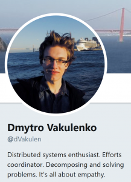

Dmitry Vakulenko
======================

[Sergey Bykov](https://github.com/sergeybykov)
11/19/2018 1:57:59 PM

* * * * *

Dmitry Vakulenko joined the Orleans open source community three years ago, and started submitting pull requests that focused on improving performance of the Orleans codebase.
He became the most prolific contributor outside of the current and former members of the core team.

Dmitry also contributed other improvements, but his passion continued to be performance.
Because of the compound nature of incremental optimizations, over time these improvements added up to a staggering aggregate factor. Our conservative estimate is that Dmitry's contributions combined increased performance of Orleans by about 2.6 times.

Dmitry's latest contribution was the reimplemented Scheduler. Scheduler is the "heart" of the Orleans runtime that is responsible for efficient processing of incoming requests while ensuring the single-threaded execution of each of the many thousands of grain activations.
The new version of the Scheduler contributed by Dmitry was 30% faster than the original one, yet simpler and much more debugging friendly.
It became the key feature of the 2.1.0 release.

After many months of waiting for his visa, Dmitry was finally scheduled to join the core team as a full-time Microsoft employee on October 15th.
We later learned that he had passed away three days before that date.

This is a big tragedy and an immense loss for us and the whole open source community around Orleans.
We lost a very talented engineer who was so early in his career and had all roads open to him.
We lost a colleague and a friend with whom we collaborated for years and were looking forward to work even closer.

We are incredibly grateful to Dmitry for all he has done.
It is still hard to believe that he is not with us anymore.
He will be remember as a brilliant mind and an even-tempered human being always open to new ideas and ready to help.
Thank you for everything, Dmitry!
