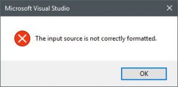

Fix Visual Studio 2015 with Orleans Tools for Visual Studio 1.4.0 installed
===========================================================================

[Attila Hajdrik](https://github.com/attilah)
3/10/2017 10:06:17 AM

* * * * *

Today two community members was hit by an issue with Visual Studio 2015 if they've installed the 1.4.0 version of the Orleans VSIX package.
We have an open issue to track this on [GitHub](https://github.com/dotnet/orleans/issues/2835).
If you installed the extension on Visual Studio 2017, it will work, only 2015 has this problem.
The issue we're seeing is that you cannot open the Tools & Extensions window, VS will show this error dialog:

 

While we working on the solution we unpublished the problematic version and published an older version of the extension which does not work with Visual Studio 2017, but neither it renders Visual Studio 2015 unusable.
If you were hit by this isse, here are the steps to fix it:

 1) Exit all Visual Studio instances.

 2) Open an Administrator Visual Studio developer command prompt.

 3) cd /D "%USERPROFILE%\\Local Settings\\Microsoft\\VisualStudio\\14.0\\Extensions"

 4) dir OrleansVSTools.dll /s 

You'll get a result like this: 

` Directory of C:\Users\\Local Settings\Microsoft\VisualStudio\14.0\Extensions\pxzkggpq.50t`

03/10/2017 02:36 PM 18,608 OrleansVSTools.dll

1 File(s) 18,608 bytes

5) Copy the full directory path to clipboard.

6) rmdir "" /q /s

Make sure you're still in the Extensions directory.

7) del \*.cache

8) devenv /setup

This can run for a few minutes...be patient.

Now you can start Visual Studio 2015 and verify that the Extensions dialog opens and everything works fine.

If you've special root suffixes configured for Visual Studio 2015 then you've to execute these commands for that specific instance, so not in the 14.0, but maybe in the 14.0Exp directory.

##### **UPDATE 3/17/2017**

We published an updated VSIX which works correctly with VS2013, VS2015, VS2017: [Microsoft Orleans Tools for Visual Studio](https://marketplace.visualstudio.com/items?itemName=sbykov.MicrosoftOrleansToolsforVisualStudio)
