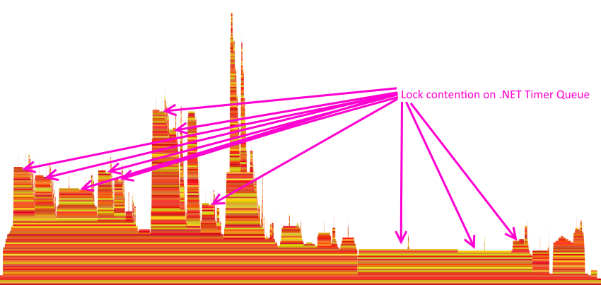

Solving a Transactions Performance Mystery
======================

[Reuben Bond](https://github.com/ReubenBond)
12/7/2018 10:08:58 AM

* * * * *

After arriving in Redmond and completing the mandatory New Employee Orientation, my first task on the Orleans team has been to assist with some ongoing performance investigations in order to ensure that Orleans' Transactions support is ready for internal users and hence release.

We were seeing significant performance issues and a large number of transaction failures in the stress/load tests against our test cluster.
A large fraction of transactions were stalling until timeout.

Our initial investigations focused on the transaction management code.
Maybe there was a deadlock somewhere.
We took a divide-and-conquer approach, replacing internal transaction components with stubbed-out variants.
The problem was more-or-less isolated to the `ITransactionalState<T>` implementation which sits on every grain.
The transactional state is responsible for loading and modifying grain state and handling the various transaction phases (Start, Prepare, Abort, Commit, Confirm) as well as optimizing multiple overlapping transactions within the isolation guarantees using a reader-writer lock.
You can see that it's not a small amount of code, but isolating the issue further was proving difficult for reasons not limited to the fact that taking out any one piece was not showing a dramatic improvement.

Profiling data is critical for performance investigations, so after requesting obtaining permissions to directly access the machines in our test cluster, we collected ETW logs using [PerfView](https://github.com/Microsoft/perfview) using a command similar to this:

    PerfView.exe /acceptEULA /noGui /threadTime /zip /maxCollectSec:30 /dataFile:1.etl collect

Analyzing the resulting `.etl` file locally, looking at a [flame graph](http://www.brendangregg.com/flamegraphs.html) for the stack trace samples, the problem is immediately apparent.

PerfView makes the cause of the issue apparent.

The details are too small to read on that view, but by hovering the mouse over each of the bars we can see which method that stack frame represents.
The arrows point to the stack frames where the CPU is waiting on a lock and in this case, that lock is on the global .NET Timer queue.
The plateau towards the right is from the thread servicing the timer queue and firing the expired timers, which also needs to acquire the lock.

Our load tests are running on .NET Framework 4.6.2 and therefore `System.Threading.Timer` is implemented using a [global queue (linked list) of timers](https://referencesource.microsoft.com/#mscorlib/system/threading/timer.cs,208ff87939c84fe3) which is protected by a single lock object. Any operations on this queue must acquire that lock. This is something we were already aware of and Orleans 2.1.0 includes a [PR which alleviates potential lock contention
on this queue](https://github.com/dotnet/orleans/pull/4399) for our main source of timers (response timeout timers).

The transactions code never uses `Timer`, so why is this a problem? Transactions makes use of `Task.Delay` for several kinds of tasks and it shows up in most components.
This is why we couldn't narrow down the performance issues to one particular piece of code. `Task.Delay` uses a `Timer` under the hood, creating a `Timer` which might fire once (if it isn't canceled) and deregisters it once it's no longer needed. Our use of `Task.Delay` was causing this performance degradation under load.

A .NET Core 3.0 user may never have seen such contention, since a good deal of work has gone into .NET Core to improve `Timer` and `Task.Delay` performance.
See [\#14527](https://github.com/dotnet/coreclr/pull/14527) and [\#20302](https://github.com/dotnet/coreclr/pull/20302).

How do we fix this contention? After verifying that a fix here would actually remedy the problem (success!), I set to work implementing a hopefully simple replacement for `Task.Delay`. The result is [in this PR](https://github.com/dotnet/orleans/pull/5201).
The gist of how it works is that it uses a single `Timer` instance to service thread-local timer collections. The firing of the timers does not need to be precise, so having a timer fire late is not a concern in these uses.
Lock contention is largely avoided by using thread-local data structures, but safety is retained by using a light-weight reentrant `Interlock.CompareExchange` lock.
See [the PR](https://github.com/dotnet/orleans/pull/5201) for more details.

The implementation is based on earlier work by [@dVakulen](https://github.com/dVakulen) in [\#2060](https://github.com/dotnet/orleans/pull/2060/files#diff-a694ce799337a9585c6bb404e7ca2339) and resulted in an approximately 4x increase in throughput with failure rates dropping to zero.
Mystery solved.
